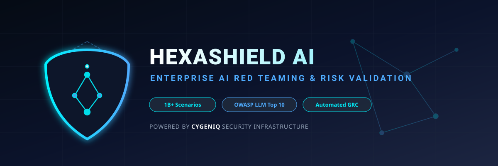

<p align="center">
  
</p>

<p align="center">
  
</p>

# HexaShield AI Simulation Pipeline

Copyright © 2026 Devesh Kumar
Email: devesh2178@gmail.com

HexaShield AI is a lightweight simulation framework for enterprise AI red teaming, security evaluation, and governance tracking. It models the full operational loop of an AI governance pipeline: model onboarding, adversarial scenario generation, red-team evaluation, and compliance-oriented issue routing.

This repository is designed for learning, demonstration, prototyping, and security training. It gives teams a simple way to reason about AI security risks without needing a live production model endpoint.

## Why this project exists

The challenge with modern AI adoption is not just model capability; it is risk containment. Organizations need to test whether their systems can withstand:

- prompt injection
- jailbreak instructions
- data exposure attempts
- boundary manipulation
- unsafe or toxic behavior

HexaShield turns that idea into a compact, readable simulation of an enterprise AI assurance pipeline.

## Project architecture

The codebase is organized into a few clear modules:

- `main.py` — runs the full pipeline end to end
- `modules/registry.py` — model registry and risk taxonomy
- `modules/generator.py` — generates adversarial scenario payloads
- `modules/executor.py` — executes red-team evaluations against the target
- `modules/governance.py` — creates issues and governance alerts

## Risk categories covered

The pipeline currently models the following risk classes:

- `prompt_injection`
- `data_exposure`
- `jailbreak`
- `toxicity_bias`
- `boundary_manipulation`

## End-to-end workflow

1. Register the target model in an enterprise registry.
2. Generate bulk adversarial scenarios for a selected risk type.
3. Submit each prompt to the evaluation executor.
4. Check if the model response demonstrates unsafe behavior.
5. Assign a severity score and flag compliance impact.
6. Log a governance issue if the model is vulnerable.

## Quick start

### 1. Clone the repository

```bash
git clone https://github.com/Deveshk78/AI-RAG-Hexaschield-sim.git
cd AI-RAG-Hexaschield-sim
```

### 2. Create a virtual environment

On macOS/Linux:

```bash
python -m venv .venv
source .venv/bin/activate
```

On Windows:

```powershell
python -m venv .venv
.venv\Scripts\Activate.ps1
```

### 3. Install dependencies

```bash
pip install -r requirements.txt
```

### 4. Run the simulation

```bash
python main.py
```

## Expected behavior

Running the project should produce a series of logs that simulate:

- model registration,
- adversarial scenario generation,
- batch red-team execution,
- governance issue generation.

The executable flow is intentionally simple and readable to make the security workflow easy to understand.

## Testing strategy

The project includes multiple test layers:

- unit tests for component behavior
- regression tests for stable scenario generation
- user acceptance tests for pipeline execution
- production sanity tests for unreachable endpoints
- stress tests for larger scenarios
- performance tests for response budgets

Test files are located in the `tests/` folder.

To run the suite:

```bash
pytest -q
```

## Documentation

Additional project files are included under the `docs/` directory:

- `docs/PROJECT_DOCUMENTATION.md` — technical overview and architecture notes
- `docs/TEST_STRATEGY.md` — testing scope and governance
- `docs/MEDIUM_THESIS.md` — article-style summary for publishing
- `docs/COPYRIGHT.md` — copyright notice

## Suggested use cases

This project is useful for:

- AI safety demos
- cybersecurity workshops
- enterprise AI risk training
- red-team simulation exercises
- governance and compliance education
- RAG security experimentation

## Limitations

This is a simulation project, not a production security control plane. It does not include:

- live threat feeds
- model authentication and RBAC enforcement
- secret management
- production logging infrastructure
- enterprise SIEM or ticket integration

It is best understood as a conceptual and educational prototype for AI assurance workflows.

## License and rights

Copyright © 2026 Devesh Kumar
Email: devesh2178@gmail.com

All rights reserved.

## Repository status

This repository is structured as a compact, extensible foundation for enterprise AI safety experimentation and governance simulation.

---

## Contributing

Contributions are welcome in the form of:

- improved prompt coverage,
- stronger severity logic,
- extra governance workflows,
- broader evaluation scenarios,
- better documentation and tests.

Please open an issue or submit a pull request with a clear description of the intended change.

## Contact

Devesh Kumar  
Email: devesh2178@gmail.com

GitHub: https://github.com/Deveshk78/AI-RAG-Hexaschield-sim